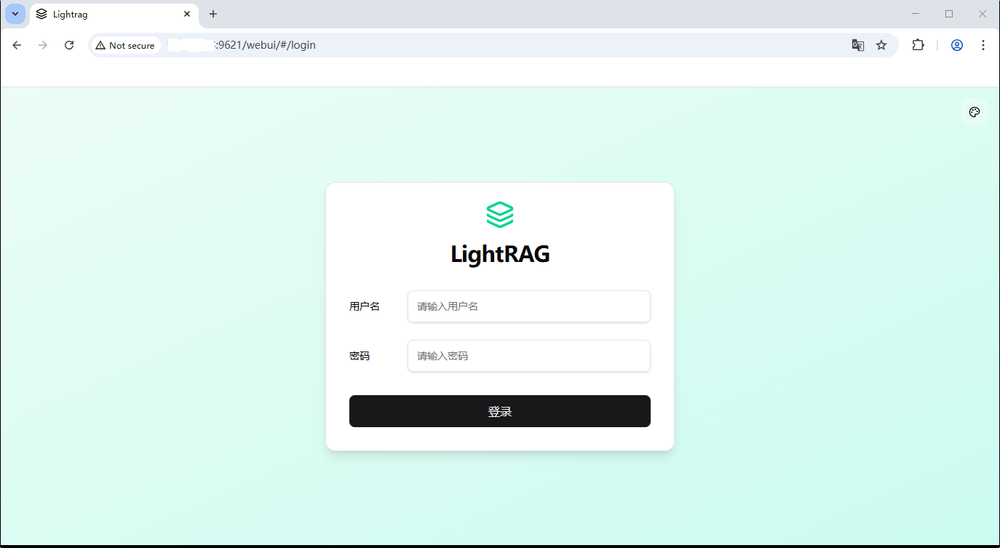
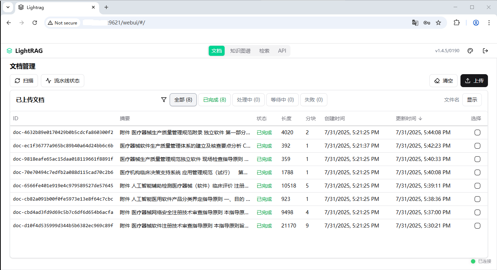
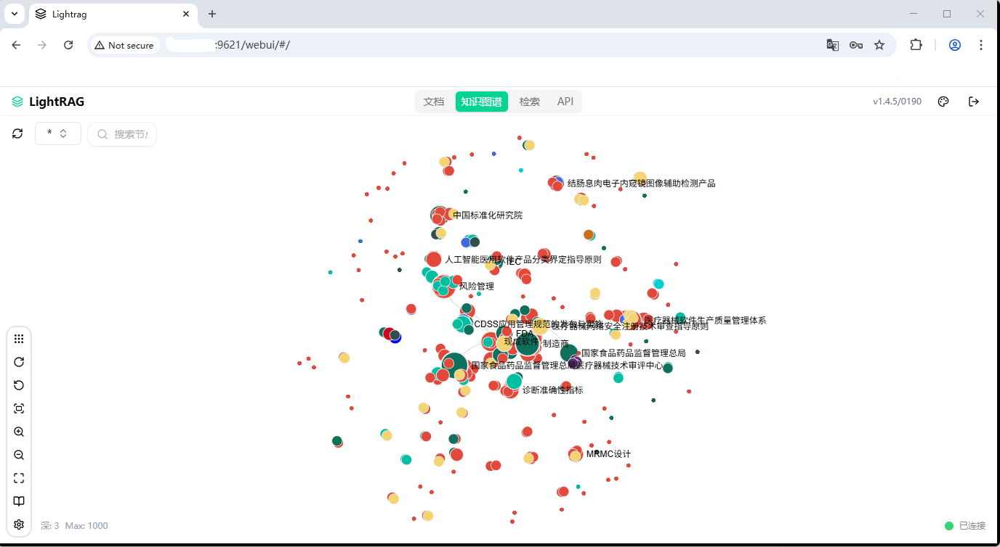
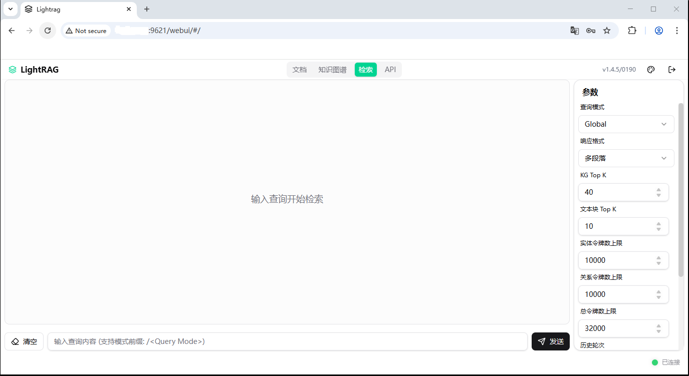
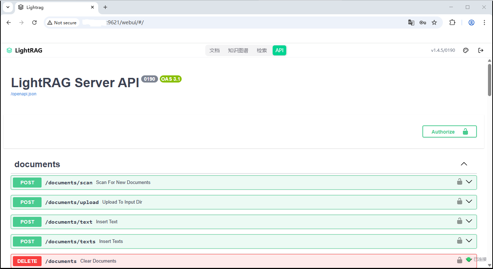

# Simple and Fast Retrieval-Augmented Generation

**original repo:** https://github.com/HKUDS/LightRAG

## 🎨 Web UI Interface

LightRAG provides a modern, intuitive web interface that makes it easy to manage documents, visualize knowledge graphs, and test retrieval capabilities. The interface supports both light and dark themes and is fully responsive for desktop and mobile devices.

### 🔐 Login Interface

Secure authentication system with API key management:



*Features: API key authentication, guest mode access, responsive design*

### 📊 Dashboard Overview

Comprehensive dashboard showing system status and quick access to all features:



*Features: System health monitoring, processing pipeline status, quick navigation,Intuitive document upload, processing, and management interface*

### 🕸️ Knowledge Graph Visualization

Interactive knowledge graph exploration with advanced layout algorithms:



*Features: Interactive node exploration, multiple layout algorithms, entity relationship visualization, search and filtering*

### 💬 Intelligent Query Interface

Powerful RAG query interface with multiple search modes:



*Features: Multiple query modes (local, global, hybrid, mix), streaming responses, conversation history, parameter tuning*

### 📚 API Documentation

Built-in API documentation with interactive testing capabilities:



*Features: Interactive API explorer, request/response examples, authentication testing, endpoint documentation*

### ✨ Key Interface Features

- **🌓 Dark/Light Theme**: Seamless theme switching for comfortable viewing
- **📱 Responsive Design**: Optimized for desktop, tablet, and mobile devices
- **🌍 Multi-language Support**: Chinese, English, French, Arabic, and more
- **⚡ Real-time Updates**: Live status updates and progress indicators
- **🎛️ Advanced Controls**: Fine-grained parameter tuning and configuration
- **📊 Visual Analytics**: Rich charts and graphs for data insights
- **🔍 Smart Search**: Intelligent search across documents and knowledge graphs
- **💾 Data Export**: Export knowledge graphs in various formats


## LightRAG API

The LightRAG Server is designed to provide Web UI and API support.  **For more information about LightRAG Server, please refer to [LightRAG Server](./lightrag/api/README.md).**

## Graph Visualization

The LightRAG Server offers a comprehensive knowledge graph visualization feature. It supports various gravity layouts, node queries, subgraph filtering, and more. **For more information about LightRAG Server, please refer to [LightRAG Server](./lightrag/api/README.md).**


## Evaluation

### Dataset

The dataset used in LightRAG can be downloaded from [TommyChien/UltraDomain](https://huggingface.co/datasets/TommyChien/UltraDomain).

### Generate Query

LightRAG uses the following prompt to generate high-level queries, with the corresponding code in `example/generate_query.py`.

<details>
<summary> Prompt </summary>

```python
Given the following description of a dataset:

{description}

Please identify 5 potential users who would engage with this dataset. For each user, list 5 tasks they would perform with this dataset. Then, for each (user, task) combination, generate 5 questions that require a high-level understanding of the entire dataset.

Output the results in the following structure:
- User 1: [user description]
    - Task 1: [task description]
        - Question 1:
        - Question 2:
        - Question 3:
        - Question 4:
        - Question 5:
    - Task 2: [task description]
        ...
    - Task 5: [task description]
- User 2: [user description]
    ...
- User 5: [user description]
    ...
```

</details>

### Batch Eval

To evaluate the performance of two RAG systems on high-level queries, LightRAG uses the following prompt, with the specific code available in `reproduce/batch_eval.py`.

<details>
<summary> Prompt </summary>

```python
---Role---
You are an expert tasked with evaluating two answers to the same question based on three criteria: **Comprehensiveness**, **Diversity**, and **Empowerment**.
---Goal---
You will evaluate two answers to the same question based on three criteria: **Comprehensiveness**, **Diversity**, and **Empowerment**.

- **Comprehensiveness**: How much detail does the answer provide to cover all aspects and details of the question?
- **Diversity**: How varied and rich is the answer in providing different perspectives and insights on the question?
- **Empowerment**: How well does the answer help the reader understand and make informed judgments about the topic?

For each criterion, choose the better answer (either Answer 1 or Answer 2) and explain why. Then, select an overall winner based on these three categories.

Here is the question:
{query}

Here are the two answers:

**Answer 1:**
{answer1}

**Answer 2:**
{answer2}

Evaluate both answers using the three criteria listed above and provide detailed explanations for each criterion.

Output your evaluation in the following JSON format:

{{
    "Comprehensiveness": {{
        "Winner": "[Answer 1 or Answer 2]",
        "Explanation": "[Provide explanation here]"
    }},
    "Empowerment": {{
        "Winner": "[Answer 1 or Answer 2]",
        "Explanation": "[Provide explanation here]"
    }},
    "Overall Winner": {{
        "Winner": "[Answer 1 or Answer 2]",
        "Explanation": "[Summarize why this answer is the overall winner based on the three criteria]"
    }}
}}
```

</details>

### Overall Performance Table

|                      |**Agriculture**|            |**CS**|            |**Legal**|            |**Mix**|            |
|----------------------|---------------|------------|------|------------|---------|------------|-------|------------|
|                      |NaiveRAG|**LightRAG**|NaiveRAG|**LightRAG**|NaiveRAG|**LightRAG**|NaiveRAG|**LightRAG**|
|**Comprehensiveness**|32.4%|**67.6%**|38.4%|**61.6%**|16.4%|**83.6%**|38.8%|**61.2%**|
|**Diversity**|23.6%|**76.4%**|38.0%|**62.0%**|13.6%|**86.4%**|32.4%|**67.6%**|
|**Empowerment**|32.4%|**67.6%**|38.8%|**61.2%**|16.4%|**83.6%**|42.8%|**57.2%**|
|**Overall**|32.4%|**67.6%**|38.8%|**61.2%**|15.2%|**84.8%**|40.0%|**60.0%**|
|                      |RQ-RAG|**LightRAG**|RQ-RAG|**LightRAG**|RQ-RAG|**LightRAG**|RQ-RAG|**LightRAG**|
|**Comprehensiveness**|31.6%|**68.4%**|38.8%|**61.2%**|15.2%|**84.8%**|39.2%|**60.8%**|
|**Diversity**|29.2%|**70.8%**|39.2%|**60.8%**|11.6%|**88.4%**|30.8%|**69.2%**|
|**Empowerment**|31.6%|**68.4%**|36.4%|**63.6%**|15.2%|**84.8%**|42.4%|**57.6%**|
|**Overall**|32.4%|**67.6%**|38.0%|**62.0%**|14.4%|**85.6%**|40.0%|**60.0%**|
|                      |HyDE|**LightRAG**|HyDE|**LightRAG**|HyDE|**LightRAG**|HyDE|**LightRAG**|
|**Comprehensiveness**|26.0%|**74.0%**|41.6%|**58.4%**|26.8%|**73.2%**|40.4%|**59.6%**|
|**Diversity**|24.0%|**76.0%**|38.8%|**61.2%**|20.0%|**80.0%**|32.4%|**67.6%**|
|**Empowerment**|25.2%|**74.8%**|40.8%|**59.2%**|26.0%|**74.0%**|46.0%|**54.0%**|
|**Overall**|24.8%|**75.2%**|41.6%|**58.4%**|26.4%|**73.6%**|42.4%|**57.6%**|
|                      |GraphRAG|**LightRAG**|GraphRAG|**LightRAG**|GraphRAG|**LightRAG**|GraphRAG|**LightRAG**|
|**Comprehensiveness**|45.6%|**54.4%**|48.4%|**51.6%**|48.4%|**51.6%**|**50.4%**|49.6%|
|**Diversity**|22.8%|**77.2%**|40.8%|**59.2%**|26.4%|**73.6%**|36.0%|**64.0%**|
|**Empowerment**|41.2%|**58.8%**|45.2%|**54.8%**|43.6%|**56.4%**|**50.8%**|49.2%|
|**Overall**|45.2%|**54.8%**|48.0%|**52.0%**|47.2%|**52.8%**|**50.4%**|49.6%|

## Reproduce

All the code can be found in the `./reproduce` directory.

### Step-0 Extract Unique Contexts

First, we need to extract unique contexts in the datasets.

<details>
<summary> Code </summary>

```python
def extract_unique_contexts(input_directory, output_directory):

    os.makedirs(output_directory, exist_ok=True)

    jsonl_files = glob.glob(os.path.join(input_directory, '*.jsonl'))
    print(f"Found {len(jsonl_files)} JSONL files.")

    for file_path in jsonl_files:
        filename = os.path.basename(file_path)
        name, ext = os.path.splitext(filename)
        output_filename = f"{name}_unique_contexts.json"
        output_path = os.path.join(output_directory, output_filename)

        unique_contexts_dict = {}

        print(f"Processing file: {filename}")

        try:
            with open(file_path, 'r', encoding='utf-8') as infile:
                for line_number, line in enumerate(infile, start=1):
                    line = line.strip()
                    if not line:
                        continue
                    try:
                        json_obj = json.loads(line)
                        context = json_obj.get('context')
                        if context and context not in unique_contexts_dict:
                            unique_contexts_dict[context] = None
                    except json.JSONDecodeError as e:
                        print(f"JSON decoding error in file {filename} at line {line_number}: {e}")
        except FileNotFoundError:
            print(f"File not found: {filename}")
            continue
        except Exception as e:
            print(f"An error occurred while processing file {filename}: {e}")
            continue

        unique_contexts_list = list(unique_contexts_dict.keys())
        print(f"There are {len(unique_contexts_list)} unique `context` entries in the file {filename}.")

        try:
            with open(output_path, 'w', encoding='utf-8') as outfile:
                json.dump(unique_contexts_list, outfile, ensure_ascii=False, indent=4)
            print(f"Unique `context` entries have been saved to: {output_filename}")
        except Exception as e:
            print(f"An error occurred while saving to the file {output_filename}: {e}")

    print("All files have been processed.")

```

</details>

### Step-1 Insert Contexts

For the extracted contexts, we insert them into the LightRAG system.

<details>
<summary> Code </summary>

```python
def insert_text(rag, file_path):
    with open(file_path, mode='r') as f:
        unique_contexts = json.load(f)

    retries = 0
    max_retries = 3
    while retries < max_retries:
        try:
            rag.insert(unique_contexts)
            break
        except Exception as e:
            retries += 1
            print(f"Insertion failed, retrying ({retries}/{max_retries}), error: {e}")
            time.sleep(10)
    if retries == max_retries:
        print("Insertion failed after exceeding the maximum number of retries")
```

</details>

### Step-2 Generate Queries

We extract tokens from the first and the second half of each context in the dataset, then combine them as dataset descriptions to generate queries.

<details>
<summary> Code </summary>

```python
tokenizer = GPT2Tokenizer.from_pretrained('gpt2')

def get_summary(context, tot_tokens=2000):
    tokens = tokenizer.tokenize(context)
    half_tokens = tot_tokens // 2

    start_tokens = tokens[1000:1000 + half_tokens]
    end_tokens = tokens[-(1000 + half_tokens):1000]

    summary_tokens = start_tokens + end_tokens
    summary = tokenizer.convert_tokens_to_string(summary_tokens)

    return summary
```

</details>

### Step-3 Query

For the queries generated in Step-2, we will extract them and query LightRAG.

<details>
<summary> Code </summary>

```python
def extract_queries(file_path):
    with open(file_path, 'r') as f:
        data = f.read()

    data = data.replace('**', '')

    queries = re.findall(r'- Question \d+: (.+)', data)

    return queries
```

</details>

## 🔗 Related Projects

*Ecosystem & Extensions*

<div align="center">
  <table>
    <tr>
      <td align="center">
        <a href="https://github.com/HKUDS/RAG-Anything">
          <div style="width: 100px; height: 100px; background: linear-gradient(135deg, rgba(0, 217, 255, 0.1) 0%, rgba(0, 217, 255, 0.05) 100%); border-radius: 15px; border: 1px solid rgba(0, 217, 255, 0.2); display: flex; align-items: center; justify-content: center; margin-bottom: 10px;">
            <span style="font-size: 32px;">📸</span>
          </div>
          <b>RAG-Anything</b><br>
          <sub>Multimodal RAG</sub>
        </a>
      </td>
      <td align="center">
        <a href="https://github.com/HKUDS/VideoRAG">
          <div style="width: 100px; height: 100px; background: linear-gradient(135deg, rgba(0, 217, 255, 0.1) 0%, rgba(0, 217, 255, 0.05) 100%); border-radius: 15px; border: 1px solid rgba(0, 217, 255, 0.2); display: flex; align-items: center; justify-content: center; margin-bottom: 10px;">
            <span style="font-size: 32px;">🎥</span>
          </div>
          <b>VideoRAG</b><br>
          <sub>Extreme Long-Context Video RAG</sub>
        </a>
      </td>
      <td align="center">
        <a href="https://github.com/HKUDS/MiniRAG">
          <div style="width: 100px; height: 100px; background: linear-gradient(135deg, rgba(0, 217, 255, 0.1) 0%, rgba(0, 217, 255, 0.05) 100%); border-radius: 15px; border: 1px solid rgba(0, 217, 255, 0.2); display: flex; align-items: center; justify-content: center; margin-bottom: 10px;">
            <span style="font-size: 32px;">✨</span>
          </div>
          <b>MiniRAG</b><br>
          <sub>Extremely Simple RAG</sub>
        </a>
      </td>
    </tr>
  </table>
</div>

---

## 📖 Citation

```python
@article{guo2024lightrag,
title={LightRAG: Simple and Fast Retrieval-Augmented Generation},
author={Zirui Guo and Lianghao Xia and Yanhua Yu and Tu Ao and Chao Huang},
year={2024},
eprint={2410.05779},
archivePrefix={arXiv},
primaryClass={cs.IR}
}
```


