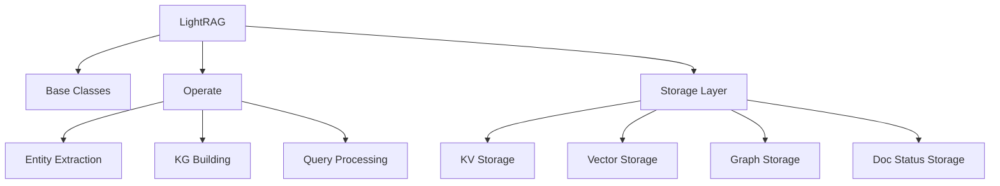
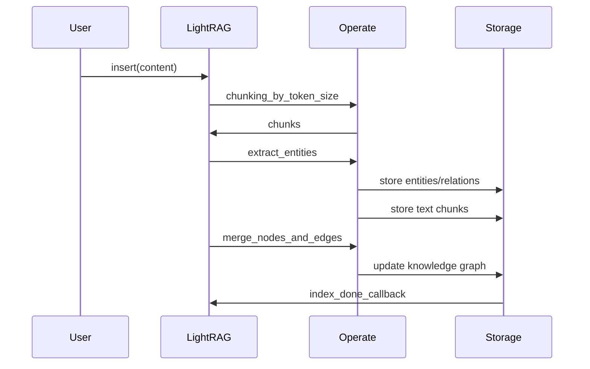
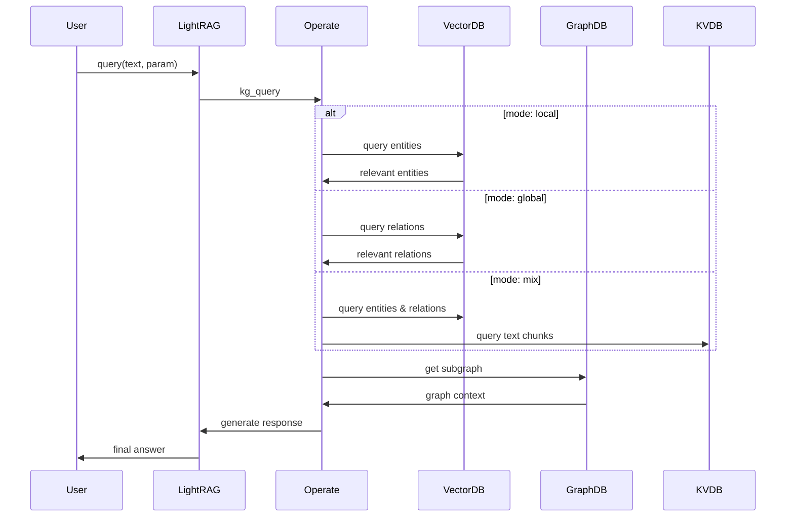

# LightRAG 核心模块和存储系统文档

## 概述

LightRAG 采用模块化架构，核心包括文档处理、实体提取、知识图谱构建和查询检索。存储系统支持多种后端，通过适配器模式实现统一接口。

## 核心模块架构

### 主要模块组成

```
lightrag/
├── lightrag.py         # 核心 LightRAG 类
├── base.py             # 基础抽象类和接口
├── operate.py          # 核心操作逻辑
├── utils.py            # 工具函数库
├── prompt.py           # 提示词模板
├── types.py            # 类型定义
├── constants.py        # 常量配置
└── kg/                 # 存储实现
    ├── json_kv_impl.py      # JSON KV 存储
    ├── nano_vector_db_impl.py # 内置向量数据库
    ├── networkx_impl.py     # NetworkX 图存储
    ├── neo4j_impl.py        # Neo4j 图数据库
    ├── milvus_impl.py       # Milvus 向量数据库
    ├── postgres_impl.py     # PostgreSQL 存储
    ├── redis_impl.py        # Redis 存储
    └── shared_storage.py    # 共享存储管理
```

### 模块依赖关系



## 核心类详解

### 1. LightRAG 主类

**职责**：统一的 RAG 接口，协调各个子系统

**核心属性**：
```python
@dataclass
class LightRAG:
    # 目录和工作空间
    working_dir: str = "./rag_storage"
    workspace: str = ""
    
    # 存储配置
    kv_storage: str = "JsonKVStorage"
    vector_storage: str = "NanoVectorDBStorage"
    graph_storage: str = "NetworkXStorage"
    doc_status_storage: str = "JsonDocStatusStorage"
    
    # 查询参数
    top_k: int = 40
    chunk_top_k: int = 10
    max_entity_tokens: int = 10000
    max_relation_tokens: int = 10000
    
    # 文本处理
    chunk_token_size: int = 1200
    chunk_overlap_token_size: int = 100
    
    # 模型函数
    embedding_func: EmbeddingFunc
    llm_model_func: callable
    tokenizer: Tokenizer
```

**核心方法**：
```python
# 初始化和生命周期
async def initialize_storages(self) -> None
async def finalize_storages(self) -> None

# 文档管理
async def ainsert(self, content: str | list[str]) -> None
async def aquery(self, query: str, param: QueryParam) -> str

# 实体和关系管理
async def create_entity(self, name: str, data: dict) -> dict
async def edit_entity(self, name: str, data: dict) -> dict
async def create_relation(self, source: str, target: str, data: dict) -> dict
async def edit_relation(self, source: str, target: str, data: dict) -> dict
```

### 2. 基础抽象类 (`base.py`)

**存储接口抽象**：

```python
# 存储命名空间基类
@dataclass
class StorageNameSpace(ABC):
    namespace: str
    workspace: str
    global_config: dict[str, Any]
    
    @abstractmethod
    async def index_done_callback(self) -> None
    @abstractmethod
    async def drop(self) -> dict[str, str]

# KV 存储接口
class BaseKVStorage(StorageNameSpace):
    @abstractmethod
    async def get_by_id(self, id: str) -> dict | None
    @abstractmethod
    async def upsert(self, data: dict) -> None

# 向量存储接口
class BaseVectorStorage(StorageNameSpace):
    @abstractmethod
    async def query(self, query: str, top_k: int) -> list[dict]
    @abstractmethod
    async def upsert(self, data: dict) -> None

# 图存储接口
class BaseGraphStorage(StorageNameSpace):
    @abstractmethod
    async def upsert_node(self, node_id: str, data: dict) -> None
    @abstractmethod
    async def upsert_edge(self, source: str, target: str, data: dict) -> None
```

**查询参数**：
```python
@dataclass
class QueryParam:
    mode: Literal["local", "global", "hybrid", "naive", "mix", "bypass"] = "mix"
    only_need_context: bool = False
    response_type: str = "Multiple Paragraphs"
    stream: bool = False
    top_k: int = 60
    conversation_history: list[dict] = field(default_factory=list)
    enable_rerank: bool = True
```

### 3. 操作模块 (`operate.py`)

**文档分块**：
```python
def chunking_by_token_size(
    tokenizer: Tokenizer,
    content: str,
    overlap_token_size: int = 128,
    max_token_size: int = 1024
) -> list[dict]:
    """按 Token 数量分块文档"""
```

**实体提取**：
```python
async def extract_entities(
    chunks: list[TextChunkSchema],
    knowledge_graph_inst: BaseGraphStorage,
    entity_vdb: BaseVectorStorage,
    relationships_vdb: BaseVectorStorage,
    global_config: dict
) -> None:
    """从文档块中提取实体和关系"""
```

**知识图谱构建**：
```python
async def merge_nodes_and_edges(
    entity_vdb: BaseVectorStorage,
    relationships_vdb: BaseVectorStorage,
    knowledge_graph_inst: BaseGraphStorage,
    global_config: dict
) -> None:
    """合并实体和关系到知识图谱"""
```

**查询处理**：
```python
async def kg_query(
    query: str,
    knowledge_graph_inst: BaseGraphStorage,
    entity_vdb: BaseVectorStorage,
    relationships_vdb: BaseVectorStorage,
    text_chunks_db: BaseKVStorage,
    param: QueryParam,
    global_config: dict
) -> str | AsyncIterator[str]:
    """知识图谱查询"""
```

### 4. 工具模块 (`utils.py`)

**核心工具类**：
```python
# 分词器接口
class Tokenizer(Protocol):
    def encode(self, text: str) -> list[int]
    def decode(self, tokens: list[int]) -> str

class TiktokenTokenizer:
    """默认的 Tiktoken 分词器"""

# 嵌入函数
@dataclass
class EmbeddingFunc:
    embedding_dim: int
    max_token_size: int
    func: callable

# 缓存管理
async def use_llm_func_with_cache(
    prompt: str,
    llm_func: callable,
    llm_response_cache: BaseKVStorage,
    cache_type: str = "query"
) -> str
```

## 存储系统详解

### 1. 存储类型和实现

```python
STORAGE_IMPLEMENTATIONS = {
    "KV_STORAGE": [
        "JsonKVStorage",      # JSON 文件存储
        "RedisKVStorage",     # Redis 存储
        "PGKVStorage",        # PostgreSQL 存储
        "MongoKVStorage",     # MongoDB 存储
    ],
    "VECTOR_STORAGE": [
        "NanoVectorDBStorage",    # 内置向量数据库
        "MilvusVectorDBStorage",  # Milvus 向量数据库
        "PGVectorStorage",        # PostgreSQL + pgvector
        "FaissVectorDBStorage",   # Faiss 向量库
        "QdrantVectorDBStorage",  # Qdrant 向量数据库
        "MongoVectorDBStorage",   # MongoDB 向量搜索
    ],
    "GRAPH_STORAGE": [
        "NetworkXStorage",     # NetworkX 内存图
        "Neo4JStorage",        # Neo4j 图数据库
        "PGGraphStorage",      # PostgreSQL 图存储
        "MongoGraphStorage",   # MongoDB 图存储
        "MemgraphStorage",     # Memgraph 图数据库
    ],
    "DOC_STATUS_STORAGE": [
        "JsonDocStatusStorage",   # JSON 文件存储
        "RedisDocStatusStorage",  # Redis 存储
        "PGDocStatusStorage",     # PostgreSQL 存储
        "MongoDocStatusStorage",  # MongoDB 存储
    ]
}
```

### 2. 核心存储实现

#### JSON KV 存储
```python
@dataclass
class JsonKVStorage(BaseKVStorage):
    """基于 JSON 文件的 KV 存储"""
    
    async def upsert(self, data: dict) -> None:
        """插入或更新数据，自动添加时间戳"""
        current_time = int(time.time())
        async with self._storage_lock:
            for k, v in data.items():
                if k in self._data:
                    v["update_time"] = current_time
                else:
                    v["create_time"] = current_time
                    v["update_time"] = current_time
                v["_id"] = k
            self._data.update(data)

    async def index_done_callback(self) -> None:
        """索引完成时持久化到磁盘"""
        write_json(dict(self._data), self._file_name)
```

#### Nano Vector DB 存储
```python
@dataclass
class NanoVectorDBStorage(BaseVectorStorage):
    """轻量级内置向量数据库"""
    
    async def query(self, query: str, top_k: int) -> list[dict]:
        """向量相似度查询"""
        query_embedding = await self.embedding_func([query])
        
        similarities = []
        for node_id, node_data in self._data.items():
            embedding = node_data.get("embedding")
            if embedding:
                similarity = cosine_similarity(query_embedding[0], embedding)
                if similarity > self.cosine_better_than_threshold:
                    similarities.append((similarity, node_id, node_data))
        
        similarities.sort(reverse=True)
        return [{"id": node_id, "similarity": sim, **data} 
                for sim, node_id, data in similarities[:top_k]]
```

#### NetworkX 图存储
```python
@dataclass
class NetworkXStorage(BaseGraphStorage):
    """基于 NetworkX 的内存图存储"""
    
    async def upsert_node(self, node_id: str, node_data: dict) -> None:
        """插入或更新节点"""
        async with self._lock:
            if self._graph.has_node(node_id):
                self._graph.nodes[node_id].update(node_data)
            else:
                self._graph.add_node(node_id, **node_data)

    async def upsert_edge(self, source: str, target: str, edge_data: dict) -> None:
        """插入或更新边"""
        async with self._lock:
            if self._graph.has_edge(source, target):
                self._graph.edges[source, target].update(edge_data)
            else:
                self._graph.add_edge(source, target, **edge_data)
```

### 3. 存储配置和环境变量

**环境变量要求**：
```python
STORAGE_ENV_REQUIREMENTS = {
    "JsonKVStorage": [],
    "RedisKVStorage": ["REDIS_URI"],
    "PGKVStorage": ["POSTGRES_USER", "POSTGRES_PASSWORD", "POSTGRES_DATABASE"],
    "Neo4JStorage": ["NEO4J_URI", "NEO4J_USERNAME", "NEO4J_PASSWORD"],
    "MilvusVectorDBStorage": [],
    "QdrantVectorDBStorage": ["QDRANT_URL"],
}
```

**工作空间数据隔离**：
- **文件存储**：通过子目录隔离 (`working_dir/workspace/`)
- **数据库存储**：通过前缀或字段隔离
- **图数据库**：通过标签或逻辑分离

### 4. 共享存储管理

**命名空间管理**：
```python
async def get_namespace_data(namespace: str) -> dict:
    """获取命名空间数据"""

async def get_storage_lock() -> asyncio.Lock:
    """获取存储锁"""

async def set_all_update_flags(namespace: str) -> None:
    """设置更新标志"""

async def clear_all_update_flags(namespace: str) -> None:
    """清除更新标志"""
```

**进程间同步**：
- 使用文件锁和内存标志进行进程间同步
- 支持多进程安全的并发访问
- 自动检测和处理数据冲突

## 数据流程

### 1. 文档索引流程



### 2. 查询处理流程



## 扩展和定制

### 1. 添加新存储后端

```python
# 1. 继承基础接口
@dataclass
class CustomVectorStorage(BaseVectorStorage):
    async def query(self, query: str, top_k: int) -> list[dict]:
        # 实现查询逻辑
        pass
    
    async def upsert(self, data: dict) -> None:
        # 实现插入逻辑
        pass

# 2. 注册到存储映射
STORAGES["CustomVectorStorage"] = ".kg.custom_vector_impl"

# 3. 添加环境变量要求
STORAGE_ENV_REQUIREMENTS["CustomVectorStorage"] = ["CUSTOM_URL", "CUSTOM_KEY"]

# 4. 在 LightRAG 中使用
rag = LightRAG(
    vector_storage="CustomVectorStorage",
    # 其他配置...
)
```

### 2. 自定义提示词

```python
# 修改提示词模板
from lightrag.prompt import PROMPTS

PROMPTS["entity_extraction"] = """
自定义的实体提取提示词...
"""

# 或在初始化时配置
rag = LightRAG(
    addon_params={
        "entity_types": ["人物", "地点", "组织", "事件"],
        "language": "简体中文"
    }
)
```

### 3. 自定义 LLM 和嵌入函数

```python
# 自定义 LLM 函数
async def custom_llm_func(prompt, **kwargs):
    # 调用自定义 LLM API
    return response

# 自定义嵌入函数
async def custom_embed_func(texts):
    # 调用自定义嵌入 API
    return embeddings

# 配置 LightRAG
rag = LightRAG(
    llm_model_func=custom_llm_func,
    embedding_func=EmbeddingFunc(
        embedding_dim=1536,
        max_token_size=8192,
        func=custom_embed_func
    )
)
```

## 性能优化

### 1. 批量操作
- 使用批量嵌入减少 API 调用
- 批量数据库操作提升吞吐量
- 异步并发处理提高效率

### 2. 缓存策略
- LLM 响应缓存避免重复调用
- 嵌入结果缓存加速检索
- 查询结果缓存提升响应速度

### 3. 内存管理
- 及时释放大对象内存
- 使用流式处理大文档
- 合理配置并发数量

这份文档提供了 LightRAG 核心模块和存储系统的完整技术参考，帮助开发者理解架构设计和扩展系统功能。